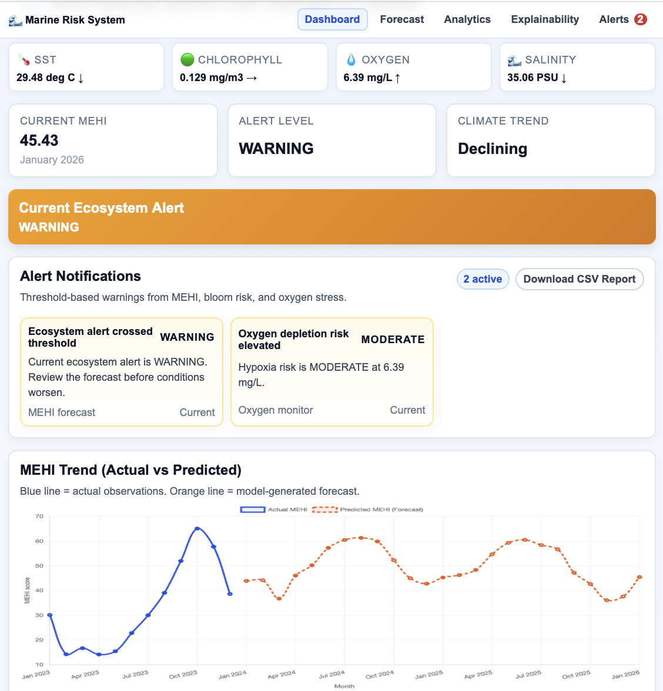
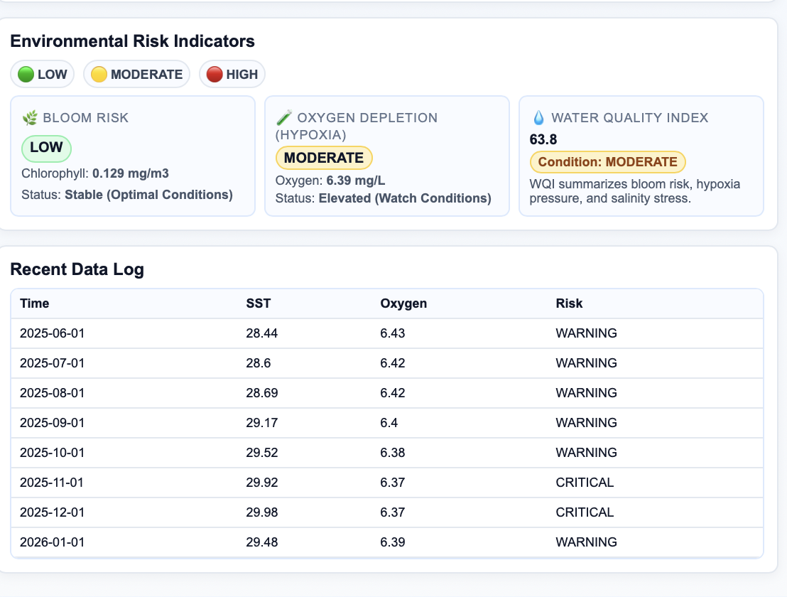
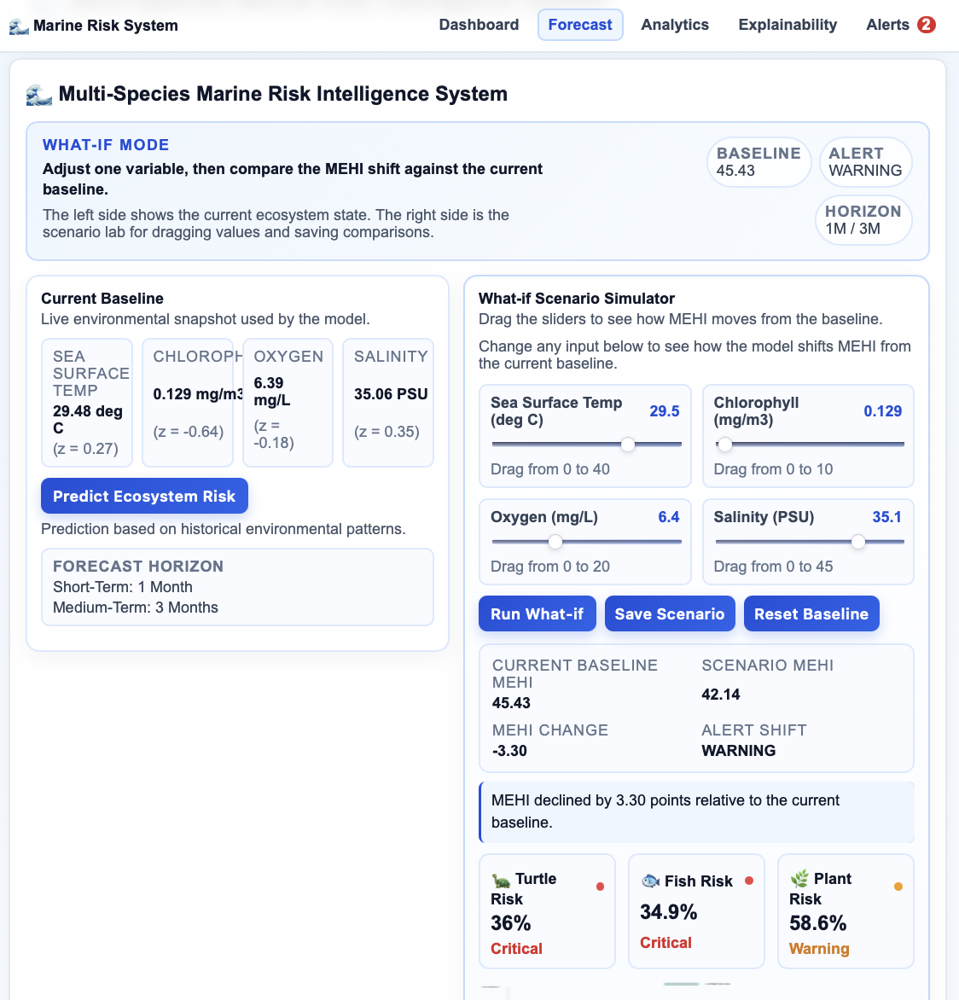
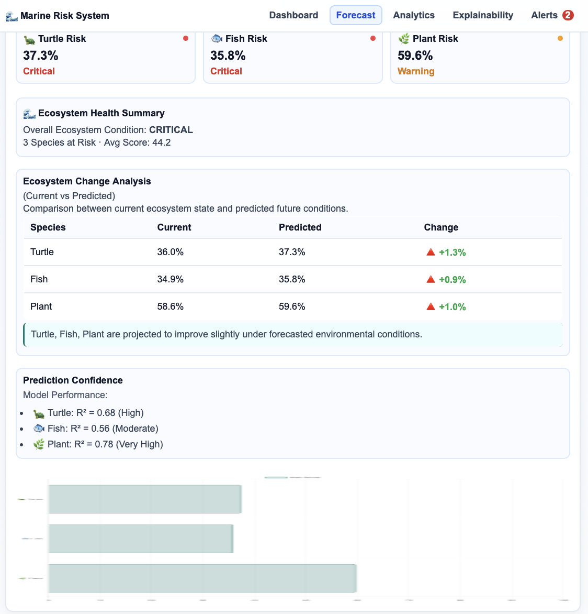
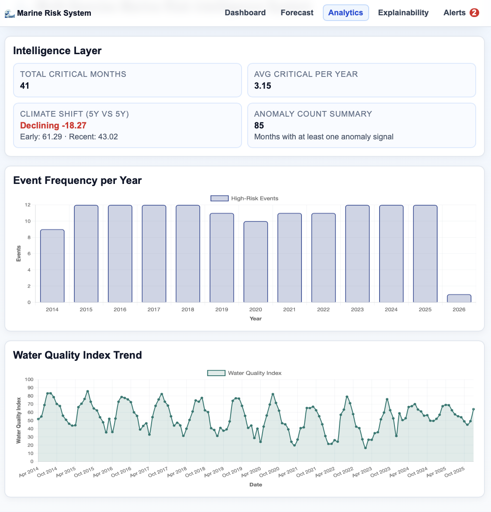
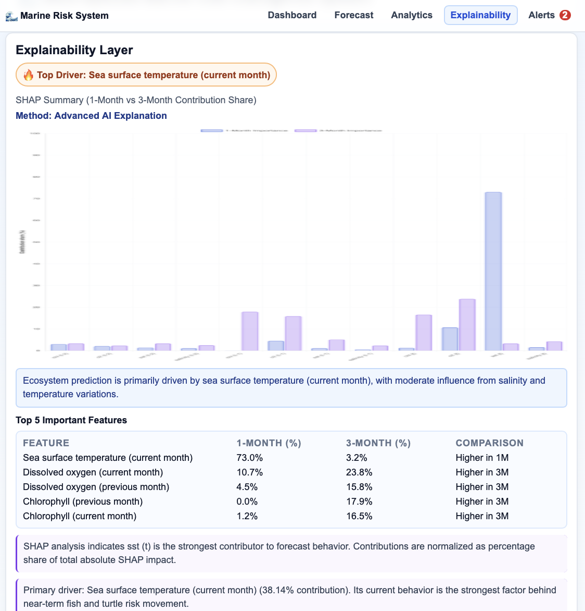

# Multi-Species Marine Risk Intelligence System

This project is a Flask-based marine monitoring dashboard that predicts ecosystem health, shows alert levels, explains key drivers, and supports live data ingestion and scenario analysis.

## What the app does

The app turns monthly ocean measurements into marine ecosystem intelligence. It estimates MEHI, classifies the current ecosystem alert level, highlights species risk, and shows how environmental changes may affect the forecast.

In practice, the app lets you:

- monitor the current MEHI and ecosystem alert state
- inspect bloom risk, oxygen depletion risk, and water quality indicators
- compare actual vs predicted MEHI over time
- review explainability output for 1-month and 3-month horizons
- run what-if scenarios with draggable inputs
- save and compare scenarios locally in the browser
- download a CSV report with forecast, alerts, and explainability details
- ingest new live environmental records through an API

## Main features

### Dashboard

- Current MEHI KPI
- Current alert level
- Climate trend summary
- Live risk notifications for threshold crossings
- Trend chart for actual vs predicted MEHI
- Environmental risk cards for bloom risk, hypoxia, and water quality

### Forecast

- Ecosystem risk prediction workflow
- Multi-species risk cards for turtle, fish, and plant
- What-if scenario simulator with drag sliders
- Baseline vs scenario MEHI comparison
- Saved scenarios stored in local browser storage

### Analytics

- Long-term MEHI trend view
- Event frequency analysis
- Climate shift metrics
- Historical alert and anomaly patterns

### Explainability

- SHAP-based comparison for 1-month and 3-month horizons
- Top feature drivers
- Percent contribution summaries
- Human-readable impact narrative for prediction drivers

### Live ingestion

- Post new ocean observations without restarting the app
- Recompute ecosystem indicators from incoming data
- Update the latest data record in the app

### Exportable reports

- Download a CSV summary from the dashboard
- Includes MEHI, alert level, risk status, notifications, and top explainability drivers

## Tech stack

### Backend

- Python 3.10+
- Flask
- pandas
- numpy
- joblib
- scikit-learn artifacts for forecasting
- SHAP when available for explainability

### Frontend

- Jinja2 templates
- HTML5
- CSS3
- Vanilla JavaScript
- Chart.js for visualizations

### Data and model assets

- `data/marine_10year_forecast_alerts.csv`
- `data/processed/marine_full_2014_2026.csv`
- `models/final_1month_model.pkl`
- `models/final_3month_model.pkl`
- `models/final_scaler_1month.pkl`
- `models/final_scaler_3month.pkl`

## System architecture

### 1) Data layer

The app loads the forecast dataset, normalizes columns, parses the `time` field, coerces numeric values, fills missing values, validates required columns, and sorts records by time.

### 2) Model layer

The app uses trained model and scaler artifacts to generate:

- 1-month MEHI predictions
- 3-month MEHI predictions
- species risk scores
- explainability summaries

### 3) Service layer

The core logic lives in `app/app.py` and includes:

- `get_dashboard_context(...)` for page data assembly
- `run_forecast(...)` for MEHI forecast generation
- `predict_multi_species_risk()` for species risk output
- `compute_importance_for_horizon(...)` for explainability
- `ingest_live_record(...)` for live updates
- `build_notification_feed(...)` for in-app alerts
- `build_export_report_rows(...)` for CSV report generation

### 4) Presentation layer

The UI uses shared layout templates and card-based sections for:

- dashboard overview
- forecast and scenarios
- analytics trends
- explainability outputs
- alerts and report export

## Routes and endpoints

### Pages

- `GET /` - Dashboard
- `GET /forecast` - Forecast page
- `GET /analytics` - Analytics page
- `GET /explainability` - Explainability page

### Forecast actions

- `POST /predict` - Run 1-month or 3-month forecast
- `POST /predict_ecosystem` - Run ecosystem forecast view
- `POST /api/simulate` - Run a what-if scenario

### Live data

- `POST /api/ingest` - Add a new live ocean record
- `GET /api/live-status` - Return latest ingested date and record count

### Export

- `GET /reports/latest.csv` - Download the latest CSV report

## Example live ingest request

```bash
curl -X POST http://127.0.0.1:5000/api/ingest \
  -H "Content-Type: application/json" \
  -d '{
    "time": "2026-03-01",
    "sst": 29.7,
    "chl": 0.18,
    "o2": 199.3,
    "salinity": 35.1
  }'
```

If you want token protection for ingestion, set:

```bash
export INGEST_TOKEN="your-secret-token"
```

Then send the header:

```bash
-H "X-INGEST-TOKEN: your-secret-token"
```

## Forecast and explainability details

The model predicts MEHI using lagged monthly windows. The explainability layer compares 1-month and 3-month feature contributions and presents the strongest drivers in a readable way. When SHAP is available, the app uses SHAP-based attribution; otherwise, it falls back to model-based feature contribution logic.

The scenario simulator lets users drag SST, chlorophyll, oxygen, and salinity values to see how the MEHI changes from the current baseline. Saved scenarios are kept in the browser so they can be loaded and compared later.

## Model metrics

The saved training report currently includes aggregate validation metrics, not per-sample residual logs. Available figures are:

- **1-month forecast**: train R² 0.980, test R² 0.864, train MAE 2.14, test MAE 5.21
- **3-month forecast**: train R² 0.963, test R² 0.417, train MAE 2.93, test MAE 12.14
- **Environmental model**: train R² 0.893, test R² 0.282, train MAE 0.14, test MAE 0.45

RMSE is not stored in the current `models/training_report.json`, so it is not available from the saved artifacts yet. If you need RMSE, it would need to be added to the retraining script and report output.

Sample prediction performance is available only as aggregate test MAE/R² in the current report, not as a stored example prediction table.

Forecast confidence is best treated as heuristic rather than calibrated probability. The app’s species cards already label each species with an R²-based reliability tag, and the forecast confidence wording should be read as a relative confidence signal from the held-out metrics.

## Model retraining

To retrain the models and regenerate the artifacts:

```bash
python3 scripts/retrain_models.py
```

Outputs include:

- `models/final_1month_model.pkl`
- `models/final_3month_model.pkl`
- `models/final_scaler_1month.pkl`
- `models/final_scaler_3month.pkl`
- `models/env_1month_model.pkl`
- `models/env_scaler_1month.pkl`
- `models/training_report.json`

## Recursive forecast generation

To rebuild the future dataset:

```bash
python3 scripts/generate_2024_2026_dataset.py
```

This script uses the last observed feature window, predicts the next environmental state, then predicts the next MEHI recursively until the target horizon is reached.

## Run the app

```bash
cd app
python3 app.py
```

Open:

```bash
http://127.0.0.1:5000

## Steps to Run the Project (Appendix)

Follow these steps to start the dashboard locally and generate forecasts.

- Create and activate a virtual environment (macOS / Linux):

```bash
python3 -m venv .venv
source .venv/bin/activate
```

- Install Python dependencies (if `requirements.txt` exists):

```bash
pip install -r requirements.txt
```

- Or install minimal required packages manually:

```bash
pip install flask pandas numpy scikit-learn joblib shap
```

- Ensure model and data assets are present under `models/` and `data/processed/`.
  - Required model files: `models/final_1month_model.pkl` (required), `models/final_3month_model.pkl` (optional)
  - Required data file: `data/processed/marine_full_2014_2026.csv` (falls back to older files if missing)

- Run the Flask server from the project root:

```bash
python3 app/app.py
```

- Open the dashboard in your browser:

```bash
http://127.0.0.1:5000
```

- Upload or ingest new records:

  - Use the UI to upload data if available, or POST a record to the ingest API:

```bash
curl -X POST http://127.0.0.1:5000/api/ingest \
  -H "Content-Type: application/json" \
  -d '{"time":"2026-03-01","sst":29.7,"chl":0.18,"o2":199.3,"salinity":35.1}'
```

- Generate a forecast or run scenarios:

  - From the UI use the Forecast page or call the scenario API:

```bash
curl -X POST http://127.0.0.1:5000/api/simulate \
  -H "Content-Type: application/json" \
  -d '{"sst":28.5,"chl":0.25,"o2":6.2,"salinity":34.8}'
```

Notes:
- If ingestion should be token-protected, set `INGEST_TOKEN` as an environment variable and include the `X-INGEST-TOKEN` header in requests.
- The app auto-loads model/scaler artifacts and will save them to `models/` if needed.

```

## Project structure

- `app/app.py` - Flask application and core logic
- `app/templates/` - HTML templates
- `app/static/style.css` - Application styling
- `data/` - source and processed datasets
- `models/` - trained model artifacts
- `scripts/` - training and dataset generation utilities
- `docs/screenshots/` - placeholder UI screenshots

## Notes

- The app auto-loads the available model and scaler artifacts.
- The forecast data source can fall back to legacy files if newer processed data is unavailable.
- The current UI includes dashboard alerts, scenario comparison, saved scenarios, and CSV export.

## Screenshots


### Dashboard



### Forecast



### Analytics


### Explainability

